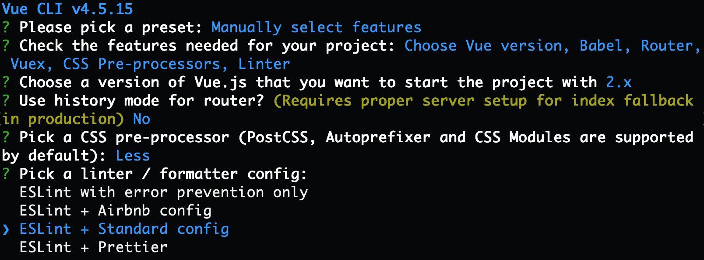
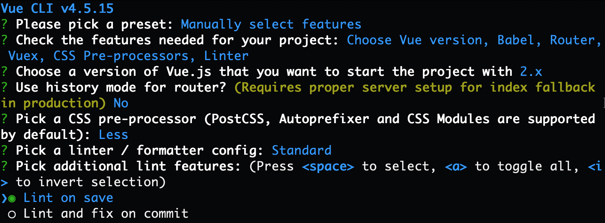

# 创建 CMS 项目

> 目标：使用 Vue CLI 创建项目并推送到 GitHub 代码仓库。

## 一. 环境准备

1. 检查 node 版本，确保 node 的版本 ≥ 12

   ```bash
   node -v
   ```

2. 修改 yarn 的淘宝镜像

   ```bash
   # 设置淘宝镜像地址
   yarn config set registry  https://registry.npm.taobao.org/

   # 查看镜像地址
   yarn config get registry
   ```

3. 安装 VSCode 插件：**ESLint** + **Vetur**

## 二. 创建项目

1. 在终端输入如下命令创建 **vue-cms-practice** 项目：

   ```bash
   vue create vue-cms-practice
   ```

2. 参考以下步骤选择**项目特性**：

   1. 选择**手动选择特性**，如下图：
      

   2. 选择项目中需要使用的特性，如下图：
      

   3. 选择 **Vue.js 2.x**，如下图：
      

   4. 不使用 `history` 模式路由，如下图：
      

   5. 选择 **Less** 作为 CSS 预处理器，如下图：
      

   6. 选择 **ESLint + 标准配置**，如下图：
      

   7. 选择**在保存文件时启用代码规范检测**，如下图：
      

   8. 选择分开独立保存 **Babel**、**ESLint** 的配置文件，如下图：
      

   9. 不选择将项目配置用于未来的项目，如下图：
      

3. 等待脚手架安装项目，完成后的界面效果如下图所示：
   

## 三. 推送到 GitHub 代码仓库

### 3.1 推送到 GitHub 代码仓库

在终端输入如下命令将项目推送到 **GitHub**：

```bash
# 进入项目目录
cd vue-cms-practice

# 修改分支名
git branch -M main

# 添加远程仓库
git remote add origin [仓库地址]

# 将代码推送到服务器
git push -u origin main

# 配置项目拉取策略
git config pull.rebase true
```

> Tips：需要提前在 GitHub 上建好空仓库。

### 3.2 安装 commitizen

1. 在终端输入如下命令安装 **commitizen** 和 **cz-conventional-changelog**：

   ```bash
   yarn add commitizen cz-conventional-changelog -D
   ```

2. 在 `package.json` 的 `scripts` 中增加 `commit` 命令，代码如下：

   ```json
   "scripts": {
     "serve": "vue-cli-service serve",
     "build": "vue-cli-service build",
     "lint": "vue-cli-service lint",
     "commit": "git-cz"
   }
   ```

3. 在 `package.json` 中增加 `config` 配置，代码如下：

   ```json
   "config": {
     "commitizen": {
       "path": "node_modules/cz-conventional-changelog"
     }
   }
   ```

> 有关 git 提交规范请参阅：<https://www.cnblogs.com/anly95/p/13163384.html>。
