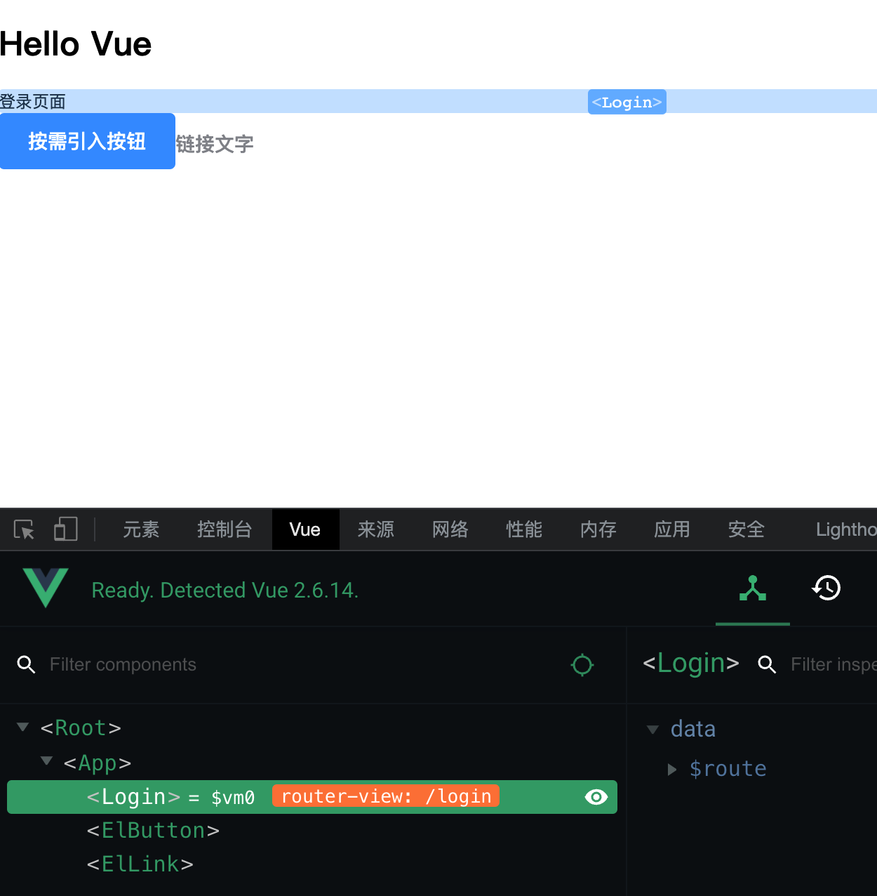

# 登录 & 注册

> 目标：完成登录注册的页面结构及业务。

## 一. 创建 Login 组件并配置路由

1. 新建 `views/Login/index.vue` 文件，实现以下代码：

   ```js
   <template>
     <div>登录页面</div>
   </template>

   <script>
   export default {
     name: 'Login',
     data () {
       return {}
     },
     methods: {}
   }
   </script>

   <style>

   </style>
   ```

2. 修改 `router/index.js` 增加登录路由，代码如下：

   ```js
   import Vue from 'vue'
   import VueRouter from 'vue-router'
   import Login from '@/views/Login'

   Vue.use(VueRouter)

   const router = new VueRouter({
     mode: 'history',
     routes: [
       {
         name: 'login',
         path: '/login',
         component: Login
       }
     ]
   })

   export default router
   ```

3. 运行测试，效果如下图所示：

   
